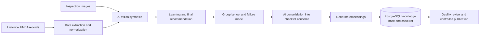
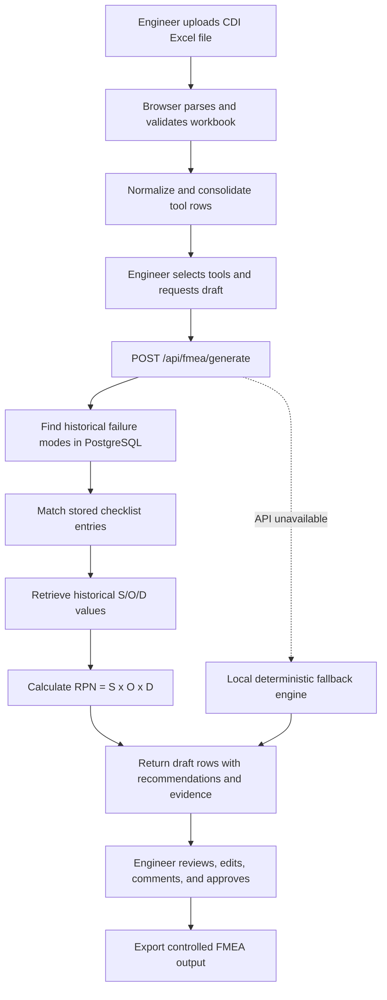

# AI FMEA Tooling Copilot

## System Flow, Technology Decisions, Checklist Strategy, Best Practices, and Future Development

**Document purpose:** Explain how the AI FMEA application works, which technologies it uses, why the checklist is not generated by AI for every request, and how the system should evolve safely.

**Audience:** Tooling engineers, manufacturing engineers, quality teams, product owners, IT teams, and software developers.

**Document status:** Current-state architecture and recommended roadmap, based on the application source as of July 2026.

---

## 1. Executive Summary

The AI FMEA Tooling Copilot helps engineers prepare a draft Failure Mode and Effects Analysis for new tooling. It converts CDI Excel data into structured tool records, finds relevant failures and recommendations from historical FMEA knowledge, attaches checklist guidance, calculates risk values, and presents the result for engineering review.

The system follows an evidence-first approach:

1. Historical FMEA records and standards are prepared as a reusable knowledge base.
2. AI is used offline, in a controlled pipeline, to summarize and consolidate historical information.
3. At runtime, the application retrieves stored and traceable knowledge instead of asking a generative model to invent a new checklist every time.
4. Severity, occurrence, detection, and RPN are handled with deterministic calculations.
5. A tooling engineer reviews and approves the draft before it becomes an official FMEA.

This approach is safer and more appropriate for engineering work than unrestricted AI generation. It improves consistency, traceability, speed, cost, and reliability while keeping final responsibility with qualified engineers.

> The application is an engineering decision-support tool. It produces a draft, not an automatically approved FMEA.

---

## 2. Business Problem

Preparing an FMEA manually requires engineers to:

- Read the new project CDI or tool plan.
- Identify every new tool and its manufacturing attributes.
- Search previous projects for similar tools and failure modes.
- Review lessons learned, first-shot findings, corrective actions, and standards.
- Estimate severity, occurrence, and detection.
- Calculate RPN.
- Create a consistent checklist and recommended actions.
- Document the evidence used for each decision.

This work is valuable but repetitive. Historical knowledge can also be difficult to find because it exists across Excel files, databases, inspection images, comments, and older FMEA records.

The AI FMEA system reduces the search and drafting effort. It does not remove engineering judgment. Its purpose is to bring relevant organizational knowledge to the engineer at the correct point in the workflow.

---

## 3. High-Level Architecture

The solution has two different flows.

### 3.1 Offline knowledge preparation

This flow runs when historical data or standards are imported or updated. It may use AI because the results can be validated before they are published.



The documented migration snapshot contains:

- 6,485 historical FMEA records.
- 6,482 AI-synthesized records.
- 7,138 migrated evidence images.
- 1,394 consolidated checklist entries in the checklist API documentation snapshot.

These values are a migration snapshot and should be re-queried from the database for live reporting.

### 3.2 Runtime FMEA drafting

This is the flow used by an engineer when creating a draft for a new project.



The runtime path is mainly retrieval, matching, and calculation. It is not a free-form generative AI call.

---

## 4. Detailed AI FMEA Flow

### Step 1: Upload and validate the CDI workbook

The user uploads an `.xlsx` or `.xlsm` CDI file. The browser validates the file and parses its workbook data.

Typical extracted fields include:

- Tool number and part reference.
- Tool or part description.
- Material and mold material.
- Gate type.
- Cavity count.
- Part weight and dimensions.
- Slide count.
- Machine tonnage.
- Tool class.
- Cycle time and capacity.
- Decoration and assembly information.

The Excel file is parsed in the browser. This is fast and reduces the need to upload the original workbook to a separate parsing service.

### Step 2: Normalize tool descriptions

Historical files often contain different names for the same tool family, including abbreviations, punctuation, plural forms, and typographical variations. The application normalizes descriptions so they can be matched consistently.

Position-specific tools are intentionally treated as different tools. For example:

- `Leg` is not automatically treated as `Leg LT`.
- `Torso` is not automatically treated as `Torso FT`.

This avoids transferring a recommendation to a geometrically or functionally different component.

### Step 3: Consolidate duplicate CDI rows

Repeated CDI rows can belong to the same physical tool. The local engine consolidates compatible rows using project code, tool number, material, gate type, and mold material.

Consolidation reduces duplicate FMEA rows and combines useful fields such as reference numbers, descriptions, part weights, colors, source rows, and capacity values.

### Step 4: Retrieve historical failure modes

The backend normalizes the incoming tool descriptions and queries the PostgreSQL `fmea_knowledge_base`.

Only valid failure modes are considered. Noise such as empty values, cost-saving statements, numeric-only entries, and non-failure comments is filtered.

The current primary lookup uses exact normalized tool descriptions. This prioritizes precision and prevents unrelated tools from being mixed.

### Step 5: Retrieve checklist concerns and recommendations

For each tool and failure-mode combination, the backend queries the precomputed `fmea_checklist`.

The matching cascade is:

1. Exact tool and failure-mode match.
2. Fuzzy text match for the same failure mode.
3. Direct fallback to the knowledge base when no checklist entry is available.

Fuzzy matching uses:

- Normalized full tool names.
- Character similarity.
- Levenshtein edit distance.
- Word-level Jaccard similarity.
- Length-ratio safeguards.
- Position-suffix rejection rules.

Batch matching is used during FMEA generation so that multiple tool/failure combinations can be processed with fewer database connections and queries.

### Step 6: Determine risk values

The backend retrieves historical severity, occurrence, and detection values for each failure mode and uses rounded historical averages when data is available.

When suitable historical values are unavailable, the backend applies controlled defaults. Severity defaults are selected from failure-mode keywords, while occurrence and detection use conservative initial values.

The Risk Priority Number is always calculated deterministically:

```text
RPN = Severity × Occurrence × Detection
```

AI should not perform this arithmetic or silently change an approved scoring scale.

### Step 7: Build the draft FMEA

The server returns structured FMEA rows containing:

- Tool and part details.
- Process step.
- Potential failure mode and effect.
- Potential cause.
- Prevention and detection controls.
- Severity, occurrence, detection, and RPN.
- Recommended action.
- Responsible function.
- Checklist matches and supporting records.

The result is sorted so rows with stronger checklist support can be presented first.

### Step 8: Engineering review

The engineer remains responsible for:

- Confirming that the historical case is physically relevant.
- Checking the S/O/D ratings against the company scoring standard.
- Verifying dimensions, materials, gate type, cavity, and process assumptions.
- Removing irrelevant recommendations.
- Adding new project-specific risks.
- Assigning owners and target dates.
- Approving the final controlled FMEA.

### Step 9: Local fallback

If the backend cannot be reached, the frontend can use a deterministic local engine. It scores bundled historical evidence using explicit rules such as tool-family, material, gate, repeated failure, closure status, and recommendation detail.

This fallback improves availability, but it should be clearly identified to users because it may use a smaller or older local dataset than the live database.

---

## 5. Where AI Is Used

The repository contains several AI-related capabilities, but they have different maturity and responsibilities.

### 5.1 Production knowledge preparation

The migration pipeline used OpenAI vision to turn historical text and inspection images into:

- A concise engineering `learning`.
- A direct `final_recommendation`.

The checklist pipeline then uses an OpenAI model to consolidate multiple learnings for the same tool and failure mode into the smallest useful set of distinct root-cause concerns. It also creates embeddings for future semantic retrieval.

This AI work happens before normal user requests. Existing checklist groups are skipped unless reprocessing is explicitly enabled, making the pipeline resumable and reducing unnecessary cost.

### 5.2 Runtime retrieval and deterministic drafting

The active `/api/fmea/generate` route retrieves historical data and stored checklist entries from PostgreSQL. It calculates risk values and builds draft rows without requiring a generative model for every request.

### 5.3 Experimental runtime AI

The backend contains a Gemini-based AI service that can generate structured draft rows and fall back to deterministic mapping. However, it is not currently connected to the primary `/api/fmea/generate` route.

It should therefore be considered experimental or future-facing, not part of the primary production flow.

### 5.4 Standards preparation

Accessory and product-standard generation scripts can use AI to convert source workbooks and images into validated structured data. The application consumes the resulting JSON as a controlled database input.

---

## 6. Technology Stack and Why It Is Used

### 6.1 Frontend

| Technology | Current role | Why it is suitable |
|---|---|---|
| React 19 | Application interface and component model | Supports interactive tables, review workflows, dashboards, uploads, and reusable engineering UI components. |
| TypeScript | Typed frontend logic and data contracts | Reduces mistakes in complex FMEA, CDI, checklist, and evidence structures. |
| Vite 7 | Development server and production bundling | Provides fast development startup and efficient modern frontend builds. |
| Tailwind CSS 3.4 | Styling and responsive design | Enables consistent layout, color, dark mode, tables, and reusable visual patterns. |
| SheetJS `xlsx` | Excel workbook parsing and export support | Appropriate for CDI files and common engineering workbook formats. |
| Recharts | Dashboard charts | Provides React-based charts for risk, failure frequency, status, and material/gate analysis. |
| Lucide React | Icons | Lightweight, consistent, and accessible interface icons. |

### 6.2 Backend

| Technology | Current role | Why it is suitable |
|---|---|---|
| Node.js and TypeScript | Server runtime | Allows shared JavaScript/TypeScript concepts across frontend and backend. |
| Express 5 | REST API | Simple and appropriate for the current API size and internal application workflow. |
| `pg` | PostgreSQL access | Provides parameterized queries, pooling, transactions, and direct control over retrieval logic. |
| CORS and JSON middleware | API communication | Supports local development and structured client/server data exchange. |

### 6.3 Data layer

| Technology | Current role | Why it is suitable |
|---|---|---|
| PostgreSQL | Live knowledge base, checklist, projects, and historical cases | Reliable relational storage, strong query support, JSON fields, indexing, and future vector-search compatibility. |
| AWS RDS PostgreSQL | Hosted database environment | Provides managed backups, availability, monitoring, and controlled infrastructure. |
| Microsoft SQL Server | Legacy/source integration | Supports migration from the existing enterprise FMEA source. It should remain a source or integration boundary rather than creating two competing runtime systems. |
| JSON/JSONL/CSV | Product standards and RAG packages | Portable, auditable, easy to validate, and suitable for controlled ingestion. |

### 6.4 AI and retrieval

| Technology | Current role | Why it is suitable |
|---|---|---|
| OpenAI vision model | Offline historical record synthesis | Can combine text and inspection-image evidence into concise learnings. |
| OpenAI text model | Offline checklist consolidation | Useful for grouping differently worded records by underlying engineering mechanism. |
| OpenAI embeddings | Checklist vector representation | Prepares the system for hybrid semantic search. |
| Gemini Flash service | Experimental runtime generation | Potentially useful for low-cost structured drafting, but it requires validation before production use. |
| Deterministic matching | Current runtime retrieval | Provides repeatability, auditability, and predictable behavior. |

### 6.5 Quality and testing

| Technology | Current role | Why it is suitable |
|---|---|---|
| Vitest | Unit testing | Fast TypeScript-friendly testing for normalization, standards, scoring, and calculation rules. |
| TypeScript compiler | Static validation | Detects invalid types, unused code, and unsafe assumptions before deployment. |

---

## 7. Why the Checklist Is Not Generated by AI Every Time

Generating a new checklist with a generative model for every user request may appear flexible, but it is not the best default for an engineering control document.

### 7.1 Consistency

The same tool and failure mode should return the same approved checklist unless the knowledge base has changed. A generative model can produce different wording or recommendations for identical requests.

A stored checklist provides reproducible results.

### 7.2 Traceability and auditability

Every checklist entry can retain:

- Supporting historical record IDs.
- Supporting failure IDs.
- Number of supporting records.
- Tool and failure-mode grouping.
- Source learning and recommendation.
- Generation and approval version.

Free-form generation on every request makes it harder to prove which evidence produced a recommendation.

### 7.3 Hallucination control

Generative AI can produce plausible engineering language that is not supported by project evidence. In FMEA work, a confident but unsupported recommendation is more dangerous than an explicit “no historical data” result.

Retrieval should return only known evidence. AI can assist with gaps, but the system must label such content as an inference and require review.

### 7.4 Latency and availability

Database retrieval normally responds much faster than a model call. It also continues to work when an AI provider is slow, rate-limited, or unavailable.

### 7.5 Cost

The offline pipeline pays the AI cost once when knowledge changes. Runtime retrieval reuses the result thousands of times at normal database cost.

Calling AI for every tool and every failure mode would create unnecessary recurring cost.

### 7.6 Data privacy

Runtime prompts may contain unreleased project names, tool details, materials, images, and manufacturing issues. Reducing external model calls reduces exposure and simplifies data-governance controls.

### 7.7 Controlled change management

Engineering standards should change through a reviewed process. A precomputed checklist can be versioned, approved, published, and retired. A newly generated checklist on every request bypasses that control.

### 7.8 AI is still useful when the knowledge base has a gap

The best architecture is not “never use AI.” It is:

1. Retrieve approved historical and standards evidence first.
2. Use deterministic rules for calculations and known mappings.
3. Detect a genuine knowledge gap.
4. Optionally ask AI for a clearly labeled advisory suggestion.
5. Require evidence citations and engineer approval.
6. Capture the reviewed outcome as a candidate for the next knowledge-base update.

---

## 8. Recommended Best-Practice Architecture

### 8.1 Use retrieval before generation

The preferred decision order is:

```text
Exact approved match
    ↓
Fuzzy or vector match with evidence
    ↓
Baseline engineering standard
    ↓
Deterministic conservative default
    ↓
Optional AI advisory for unresolved gaps
    ↓
Mandatory human review
```

### 8.2 Separate draft, reviewed, approved, and obsolete states

Every FMEA and checklist item should have a controlled lifecycle:

- Draft.
- In engineering review.
- Approved.
- Superseded.
- Rejected or obsolete.

AI output must always begin as a draft.

### 8.3 Keep calculations deterministic

The following should be application logic, not model output:

- RPN calculation.
- Score range validation.
- Required fields.
- Date and ownership rules.
- Approval permissions.
- Version numbering.
- Export templates.

### 8.4 Preserve evidence lineage

Each recommendation should link to its supporting:

- Historical FMEA record.
- Project and tool.
- Failure mode.
- First-shot or next-shot evidence.
- Image or document reference.
- Baseline standard.
- Checklist version.

### 8.5 Version AI-generated knowledge

For each offline AI run, record:

- Model and model version.
- Prompt version.
- Generation date.
- Input record IDs and hashes.
- Output validation status.
- Reviewer and approval date.
- Previous checklist version.

### 8.6 Use hybrid search

The future retrieval layer should combine:

- Exact normalized matching for precision.
- Business metadata filters.
- Fuzzy text matching for typographical variation.
- Vector similarity for semantically related evidence.
- Re-ranking based on engineering attributes such as material, gate, cavity, tool class, and closure status.

Vector search should supplement exact matching, not replace it.

### 8.7 Establish quality gates

Recommended gates include:

- Reject empty or non-engineering failure modes.
- Validate S/O/D values against the approved scale.
- Recalculate RPN server-side.
- Require a source or mark the row as “inferred.”
- Prevent position-specific tools from being merged incorrectly.
- Require review for low-confidence or no-history rows.
- Test prompt and model changes against a fixed evaluation dataset.

### 8.8 Protect sensitive data

Recommended controls include:

- Authentication and role-based access.
- Least-privilege database credentials.
- Secret management outside source files.
- Encryption in transit and at rest.
- Audit logging.
- Approved AI-provider data-retention settings.
- Redaction of confidential fields when external AI is used.
- File-size and file-type validation.

### 8.9 Monitor usefulness, not only model quality

Operational metrics should include:

- Percentage of rows with historical evidence.
- Percentage with approved checklist matches.
- Low-confidence and no-history rate.
- Engineer acceptance, edit, and rejection rate.
- Time saved per FMEA.
- Repeated failure rate after recommendation.
- False-match rate.
- Checklist age and stale-entry count.

---

## 9. Current Strengths

- Evidence-first runtime design.
- Deterministic fallback when the backend is unavailable.
- Browser-based CDI parsing.
- Batch checklist matching.
- Explicit safeguards for short names and position-specific tools.
- Stored supporting record IDs for checklist lineage.
- Server-side RPN calculation.
- PostgreSQL foundation suitable for relational and vector retrieval.
- Reusable product-standard and accessory-standard datasets.
- Dashboard and knowledge-base interfaces for organizational learning.

---

## 10. Current Limitations and Risks

### 10.1 Exact-match dependence

The primary failure-mode lookup currently depends on exact normalized tool descriptions. This is precise but may miss relevant history for new naming patterns.

### 10.2 Stored embeddings are not yet used in runtime matching

The checklist pipeline creates embeddings, but the current checklist service uses text similarity rather than a vector index.

### 10.3 Different normalization functions

There are normalization functions in multiple areas of the application. They should be consolidated into one versioned shared library to prevent frontend, backend, and migration differences.

### 10.4 Conservative defaults need governance

Keyword-based severity and fixed occurrence/detection defaults are useful fallbacks, but the company must approve and document these rules.

### 10.5 Experimental AI service is separate from the primary route

The Gemini service exists but is not connected to the active generation endpoint. This is safer than silently using it, but its intended production role should be formally decided.

### 10.6 Database access can be optimized further

Some backend steps still query failure modes sequentially. These can be converted into fully batched queries and transactions.

### 10.7 Human approval workflow is incomplete

The interface supports drafting and review concepts, but production use needs persistent approvals, role-based permissions, version history, and electronic audit records.

### 10.8 Test and build health

The project should maintain a clean TypeScript build and a fully passing test suite before production release. Matching, consolidation, and RPN rules require regression tests because small changes can affect many FMEA rows.

---

## 11. Future Development Roadmap

### Phase 1: Production foundation — 0 to 3 months

- Fix all TypeScript build errors and failing tests.
- Add authentication, role-based permissions, and user identity.
- Store projects, drafts, reviews, comments, approvals, and exports persistently.
- Add complete audit logs and checklist/FMEA versioning.
- Consolidate normalization into one shared library.
- Validate every API request and response with schemas.
- Batch all S/O/D queries and improve database indexing.
- Display source records and evidence links directly beside every recommendation.
- Clearly label live-database, local-fallback, inferred, and AI-assisted results.
- Establish database backup, recovery, and retention policies.

### Phase 2: Hybrid RAG retrieval — 3 to 6 months

- Enable `pgvector` or an equivalent vector index.
- Use exact match, metadata filters, fuzzy matching, and embeddings together.
- Re-rank results using material, gate type, cavity, tool class, process, and closure status.
- Add configurable similarity thresholds by tool category.
- Add “why this matched” explanations.
- Create an evaluation dataset of known good and bad matches.
- Add incremental checklist regeneration for new or changed historical records.

### Phase 3: Controlled AI assistance — 6 to 12 months

- Use AI only for no-history or low-confidence cases.
- Require structured output validated against a schema.
- Require citations to retrieved evidence.
- Block unsupported dimensions or claims.
- Add prompt, model, and output version tracking.
- Compare AI suggestions with deterministic baselines.
- Add an engineer feedback loop: accept, edit, reject, and reason.
- Promote only reviewed outcomes into the reusable knowledge base.

### Phase 4: Multimodal engineering intelligence — 6 to 12 months

- Retrieve relevant inspection images with each historical case.
- Use controlled vision analysis for first-shot and next-shot evidence.
- Extract dimensions and annotations with source-image coordinates.
- Link recommendations to the exact document page or image region.
- Add duplicate-image and image-quality checks.

### Phase 5: Enterprise integration — 12 months and beyond

- Integrate with PLM, QMS, MES, supplier, and project systems.
- Synchronize controlled part, material, tool, and failure taxonomies.
- Support organization-approved FMEA templates and scoring standards.
- Add notifications, escalations, and review service-level targets.
- Track whether recommended actions reduced repeated failures.
- Develop predictive risk indicators using validated historical outcomes.
- Support multiple factories, product families, and languages with controlled taxonomies.

---

## 12. Recommended Target Architecture

```mermaid
flowchart TB
    subgraph Sources
        S1[CDI and tool plans]
        S2[Historical FMEA]
        S3[Inspection images]
        S4[Product standards]
    end

    subgraph Controlled Knowledge Pipeline
        P1[Extract and normalize]
        P2[AI-assisted synthesis]
        P3[Validation and engineering approval]
        P4[Versioned checklist and embeddings]
    end

    subgraph Runtime Services
        R1[Exact and metadata retrieval]
        R2[Fuzzy and vector retrieval]
        R3[Deterministic risk engine]
        R4[Optional gap-only AI advisor]
        R5[Evidence and confidence service]
    end

    subgraph Governance
        G1[Authentication and RBAC]
        G2[Audit and version history]
        G3[Evaluation and monitoring]
        G4[Data and model governance]
    end

    subgraph User Workflow
        U1[Upload project]
        U2[Review draft]
        U3[Approve and export]
        U4[Capture outcome and feedback]
    end

    S1 --> U1
    S2 --> P1
    S3 --> P1
    S4 --> P1
    P1 --> P2 --> P3 --> P4
    P4 --> R1
    P4 --> R2
    U1 --> R1
    R1 --> R2 --> R3
    R3 --> R5 --> U2
    R2 -. knowledge gap .-> R4
    R4 --> R5
    U2 --> U3 --> U4
    U4 --> P1
    G1 -. controls .-> Runtime Services
    G2 -. controls .-> User Workflow
    G3 -. measures .-> Runtime Services
    G4 -. governs .-> Controlled Knowledge Pipeline
```

---

## 13. Decision Summary

| Decision | Recommendation |
|---|---|
| Generate the checklist with AI on every request? | No. Retrieve a versioned, approved checklist by default. |
| Remove AI completely? | No. Use it offline for consolidation and selectively for genuine knowledge gaps. |
| Let AI calculate RPN? | No. Calculate and validate RPN deterministically. |
| Accept AI output automatically? | No. AI output must remain a draft until engineer approval. |
| Use vector search alone? | No. Use hybrid exact, metadata, fuzzy, and vector retrieval. |
| Reprocess all historical data after every update? | No. Use incremental, resumable, versioned processing. |
| Store evidence lineage? | Yes. It is essential for trust, audit, and continuous improvement. |
| Treat the local fallback as equivalent to the live database? | No. Label its source and dataset limitations clearly. |

---

## 14. Implementation Reference

### Key application files

| Area | File | Responsibility |
|---|---|---|
| Application workflow | `src/App.tsx` | Controls upload, generation, review, dashboard, and export views. |
| CDI parsing | `src/services/cdiParser.ts` | Converts workbook content into structured project and tool rows. |
| Frontend generation service | `src/services/fmeaGenerator.ts` | Calls the backend and activates the local deterministic fallback when required. |
| Local risk engine | `src/lib/fmeaEngine.ts` | Consolidates tools, scores evidence, calculates RPN, and builds deterministic suggestions. |
| Local evidence retrieval | `src/services/ragRetriever.ts` | Matches bundled historical cases and baseline standards. |
| Backend API | `server/index.ts` | Provides generation, dashboard, knowledge-base, and checklist endpoints. |
| Checklist matcher | `server/checklistService.ts` | Performs exact, fuzzy, protected suffix, and batch checklist matching. |
| Experimental AI service | `server/aiService.ts` | Contains the optional Gemini structured-generation experiment and fallback. |
| Checklist preparation | `migration/generate_checklist.ts` | Consolidates historical learnings with AI, creates embeddings, and stores checklist entries. |
| Migration report | `migration/README.md` | Documents historical migration, vision synthesis, quality, and cost results. |
| Accessory RAG guidance | `rag_package/README_RAG_ingestion.md` | Defines structured checklist, image, and RAG ingestion recommendations. |

### Primary runtime API endpoints

| Endpoint | Purpose |
|---|---|
| `POST /api/fmea/generate` | Generate evidence-based draft FMEA rows for selected tools. |
| `GET /api/dashboard/stats` | Retrieve projects and historical cases for dashboard analytics. |
| `GET /api/dashboard/case/:id/details` | Retrieve the action history for a knowledge-base case. |
| `GET /api/knowledge/search` | Search historical knowledge using filters and query terms. |
| `GET /api/knowledge/filters` | Retrieve filter values for knowledge-base search. |
| `GET /api/knowledge/:id/images` | Retrieve evidence images for a historical record. |
| `GET /api/checklist/match` | Match checklist entries for one tool and failure mode. |
| `POST /api/checklist/match-batch` | Match checklist entries for multiple combinations efficiently. |
| `GET /api/checklist/stats` | Retrieve checklist coverage statistics. |
| `GET /api/checklist/failure-modes` | Retrieve available checklist failure modes. |

---

## 15. Conclusion

The strongest design for this AI FMEA application is a controlled hybrid system:

- AI prepares and consolidates knowledge where it adds value.
- The database stores reusable, traceable, versioned engineering guidance.
- Runtime requests retrieve evidence quickly and consistently.
- Deterministic code performs calculations and enforces rules.
- AI is reserved for unresolved gaps and clearly labeled advisory assistance.
- Engineers retain responsibility for validation and approval.

This architecture treats AI as an accelerator for organizational learning, not as an uncontrolled replacement for engineering judgment. It is the most practical path toward a system that is useful, scalable, auditable, and safe for production tooling decisions.
