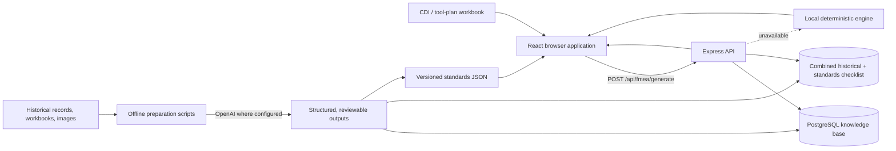

# AI FMEA Tooling Copilot

AI FMEA Tooling Copilot is an engineering decision-support application for creating draft tooling Failure Mode and Effects Analyses from new CDI/tool-plan workbooks, historical FMEA records, and controlled product standards.

The application is evidence-first:

- The browser parses the new project workbook into structured tool rows.
- The API retrieves matching historical failures and checklist guidance from PostgreSQL.
- Deterministic code calculates risk and assembles draft FMEA rows.
- The browser falls back to a bundled deterministic engine when the API is unavailable.
- OpenAI is used in offline, reviewable data-preparation pipelines—not as an uncontrolled runtime decision maker.

> This application produces an engineering draft. A qualified engineer must verify the evidence, scores, recommendations, ownership, and final controlled FMEA.

## Current status

The repository currently provides:

- CDI `.xlsx` and `.xlsm` parsing in the browser.
- Tool-row normalization and consolidation.
- PostgreSQL-backed historical FMEA, dashboard, knowledge-search, and checklist APIs.
- Deterministic local generation when the server or database is unavailable.
- Severity, occurrence, detection, and RPN handling.
- Review, editing, CSV/JSON/Excel export, and clipboard workflows.
- Product Standards and Baseline Standards (Tooling).
- Offline OpenAI pipelines for standards and historical-knowledge preparation.
- Unit tests for standards integrity, matching rules, consolidation, and risk calculations.

The current implementation does not yet provide authentication, persistent draft approval, role-based access, or a complete audit trail. Treat it as an internal prototype until those controls are implemented.

## Architecture



There are three separate execution areas:

1. **Frontend (`src/`)** — workbook parsing, user interface, local fallback, standards rendering, and exports.
2. **Runtime API (`server/`)** — PostgreSQL retrieval, checklist matching, risk defaults, dashboard data, and FMEA draft assembly.
3. **Offline preparation (`scripts/` and `migration/`)** — source extraction, OpenAI-assisted synthesis, validation, schema work, and generated datasets.

## Runtime FMEA flow

1. The engineer uploads a CDI workbook.
2. `src/services/cdiParser.ts` extracts project metadata and tool rows.
3. Tool descriptions are normalized; compatible duplicate rows are consolidated.
4. `src/services/fmeaGenerator.ts` calls `POST /api/fmea/generate`.
5. The API searches exact normalized tool descriptions in `fmea_knowledge_base`.
6. Exact Product/Baseline Standard matches add relevant failure modes that were not present in the historical records.
7. Failure modes are matched to `fmea_checklist_standard`, which preserves the historical checklist and adds source-grounded standards controls.
8. The API retrieves historical severity, occurrence, and detection values, applies controlled defaults when required, and calculates:

   ```text
   RPN = Severity × Occurrence × Detection
   ```

9. The UI displays editable draft rows and supporting recommendations.
10. If the API fails, `src/lib/fmeaEngine.ts` uses the bundled historical examples and baseline standards to produce a clearly local, deterministic draft.
11. The engineer reviews and exports the result.

Runtime drafting does not call OpenAI or another generative model. This keeps normal requests repeatable, traceable, faster, and available during model-provider outages.

## Technology stack

| Layer | Technology | Purpose |
|---|---|---|
| Frontend | React 19, TypeScript, Vite | Interactive application and production build |
| Styling | Tailwind CSS | Responsive UI and dark mode |
| Workbooks | SheetJS `xlsx` | CDI parsing and Excel export |
| Visualization | Recharts | Dashboard charts |
| API | Express 5, TypeScript | Runtime REST endpoints |
| Database | PostgreSQL via `pg` | Historical FMEA and checklist retrieval |
| Legacy import | Microsoft SQL Server via `mssql` | Optional source migration only |
| Offline AI | OpenAI Responses/Chat Completions APIs | Controlled standards and knowledge preparation |
| Tests | Vitest, TypeScript compiler | Unit, data-integrity, and type checks |

## Repository map

```text
AI FMEA/
├── src/                         React application
│   ├── components/              Active UI components
│   ├── data/                    Bundled, runtime-consumed datasets
│   ├── lib/                     Deterministic FMEA and validation logic
│   ├── services/                CDI parsing, API calls, and exports
│   ├── types/                   Active TypeScript domain models
│   └── utils/                   Excel and normalization utilities
├── server/                      Runtime Express/PostgreSQL API
│   ├── index.ts                 Routes and FMEA orchestration
│   ├── checklistService.ts      Exact/fuzzy checklist matching
│   ├── normalizeToolDescription.ts
│   ├── db.ts                    Legacy SQL Server connection helper
│   └── migrate_to_postgres.ts   Optional MSSQL-to-PostgreSQL import
├── scripts/                     Maintained standards generation utilities
├── migration/                   Maintained historical-KB preparation tools
├── rag_package/                 Accessory source evidence and RAG exports
├── public/MEC/                  Original Product Standards source archive
├── public/mec_images/           Product images referenced by current JSON
├── README.md                    The single project handover document
├── package.json                 Frontend and root maintenance commands
└── .gitattributes               Git LFS rules for engineering binaries
```

## Important data and source-of-truth files

Do not delete the following without understanding their consumers and regeneration path.

| Path | Role | Source of truth? | Regeneration |
|---|---|---:|---|
| `src/data/mec_product_standard_v2.json` | Product Standards pages rendered by the app | Yes, application database | `npm run generate:product-standards` |
| `src/data/sourceMapping.json` | Product-page to source-document mapping | Yes | Updated by Product Standards generator |
| `src/data/accessory_tooling_ai_database.json` | Baseline Standards (Tooling) rendered by the app | Yes, application database | `npm run generate:accessory-standards` |
| `src/data/accessoriesRagData.ts` | Structured legacy accessory checklist used by local matching | Yes | Preserve unless its consumer is migrated |
| `src/data/fmeaMockData.ts` | Bundled local fallback evidence and taxonomy | Yes for offline fallback | Manually maintained |
| `src/data/cdiMockData.ts` | Demo/fallback CDI project | Yes for demo mode | Manually maintained |
| `migration/raw_fmea_data.json` | Historical migration source snapshot | Yes for replay/recovery | Re-extract from the legacy system |
| `migration/create_checklist_standard_table.sql` | Schema for the combined runtime checklist | Yes for table structure | Apply through `checklist-standard:generate` |
| `migration/generate_checklist_standard.ts` | Resumable historical + Product/Baseline Standards pipeline | Yes for generation behavior | `npm --prefix migration run checklist-standard:generate` |
| `migration/verify_checklist_standard.ts` | Read-only preservation, provenance, and uniqueness audit | Yes for verification behavior | `npm --prefix migration run checklist-standard:verify` |
| `rag_package/data/*` | Accessory RAG/checklist/index exports | Yes for downstream ingestion | Rebuild from accessory source workbook |
| `rag_package/images/original/*` | Original embedded accessory images | Yes | Extract from source workbook |
| `public/MEC/*` | Original Product Standards engineering documents | Yes | External controlled archive |
| `Copy of MEC-Product-Standard-revision.xlsx` | Product Standards master workbook | Yes | Controlled source workbook |
| `Copy of Standart Accesoris_Updated.xlsx` | Accessory/Baseline Standards master workbook | Yes | Controlled source workbook |

Generated JSON is committed intentionally because the application imports it at build time. Intermediate OpenAI cache files under `migration/accessory_baseline_ai_work/` are retained locally for resumability but ignored by Git.

## Prerequisites

- Node.js 20 or newer.
- npm.
- Git LFS.
- PostgreSQL access for live dashboard, knowledge-base, and checklist features.
- Microsoft SQL Server access only when rerunning the legacy source migration.
- An OpenAI API key only when running offline AI preparation.

## First-time setup

Clone with Git LFS and install all three Node workspaces:

```bash
git lfs install
git lfs pull
npm run install:all
```

Create the shared PostgreSQL/OpenAI configuration:

PowerShell:

```powershell
Copy-Item migration/.env.template migration/.env
```

Bash:

```bash
cp migration/.env.template migration/.env
```

Fill in only the credentials needed for your work. `migration/.env` is ignored by Git and must never be committed.

## Environment variables

Runtime PostgreSQL and offline-pipeline configuration lives in `migration/.env`. The optional legacy SQL Server import uses `server/.env` so its source-system credentials stay isolated.

| Variable | Required for | Notes |
|---|---|---|
| `PG_HOST`, `PG_PORT`, `PG_USER`, `PG_PASSWORD`, `PG_DATABASE` | Runtime API and PostgreSQL migration tools | Live knowledge base |
| `OPENAI_API_KEY` | Offline AI generation | Never expose to the browser |
| `OPENAI_MODEL` | Legacy historical-FMEA synthesis | Defaults remain controlled by the migration script |
| `ACCESSORY_OPENAI_MODEL` | Baseline Standards generation | Recommended: `gpt-5.6-sol` |
| `ACCESSORY_IMAGE_REASONING_EFFORT` | Accessory image analysis | Current default: `low` |
| `ACCESSORY_REASONING_EFFORT` | Accessory synthesis | Current default: `medium` |
| `PRODUCT_STANDARDS_OPENAI_MODEL` | Product Standards repair | Recommended: `gpt-5.6-sol` |
| `PRODUCT_STANDARDS_REASONING_EFFORT` | Product Standards synthesis | Current default: `medium` |
| `CHECKLIST_STANDARD_MODEL` | Combined checklist generation | Defaults to `gpt-5.6-terra` |
| `CHECKLIST_STANDARD_REASONING_EFFORT` | Combined checklist generation | Defaults to `low` |
| `CHECKLIST_STANDARD_EMBEDDING_MODEL` | Combined checklist embeddings | Defaults to `text-embedding-3-small` |
| `CHECKLIST_STANDARD_CONCURRENCY` | Parallel offline API requests | Defaults to `3`; reduce for rate limits |

The current Product Standards and Baseline Standards generators use the specialized model variables. The generic `OPENAI_MODEL` is retained only for the older historical-FMEA synthesis pipeline.

Only when importing from the legacy Microsoft SQL Server, create `server/.env`:

PowerShell:

```powershell
Copy-Item server/.env.template server/.env
```

Bash:

```bash
cp server/.env.template server/.env
```

That file contains `DB_USER`, `DB_PASSWORD`, `DB_SERVER`, `DB_PORT`, and `DB_NAME`. It is not read by the normal runtime API.

## Running locally

Use two terminals.

Terminal 1 — API:

```bash
npm run dev:server
```

Terminal 2 — frontend:

```bash
npm run dev
```

The frontend runs through Vite. Requests under `/api` are proxied to `http://localhost:3001`.

If PostgreSQL or the API is unavailable, draft generation falls back to bundled local evidence. Dashboard and live knowledge-base features still require the API.

## Validation

Run the complete repository check before committing:

```bash
npm run check
```

This runs:

1. Vitest unit and data-integrity tests.
2. Frontend TypeScript compilation.
3. Vite production build.
4. Server TypeScript checking.

Individual commands:

```bash
npm test
npm run build
npm run check:server
```

The production build currently reports a large JavaScript-chunk warning. The build succeeds, but future work should split dashboard, knowledge, and standards views with dynamic imports.

## Runtime API

Base URL during local development: `http://localhost:3001`.

| Method and path | Purpose |
|---|---|
| `POST /api/fmea/generate` | Generate draft rows from submitted tools and project metadata |
| `GET /api/dashboard/stats` | Dashboard projects and historical cases |
| `GET /api/dashboard/case/:id/details` | Timeline/action detail for one case |
| `GET /api/knowledge/search` | Filtered historical-knowledge search |
| `GET /api/knowledge/filters` | Available search filter values |
| `GET /api/knowledge/:id/images` | Evidence images for one record |
| `GET /api/knowledge/historical-for-failure` | Historical records for a tool/failure combination |
| `GET /api/checklist/match` | Checklist matches for one tool and failure mode |
| `POST /api/checklist/match-batch` | Batched checklist matching |
| `GET /api/checklist/stats` | Checklist coverage metrics |
| `GET /api/checklist/failure-modes` | Available checklist failure modes |

Example generation request:

```json
{
  "tools": [
    {
      "toolNo": "Q501",
      "toolDescription": "Headband",
      "material": "ABS",
      "gateType": "Sub gate",
      "cavity": 2
    }
  ],
  "metadata": {
    "projectName": "Example Project",
    "sourceFilename": "example-cdi.xlsm"
  }
}
```

Example checklist query:

```text
GET /api/checklist/match?toolDescription=Headband&failureMode=Sharp%20point&threshold=0.75&limit=5
```

Database statistics shown in historical documentation were snapshots. Query `/api/checklist/stats` for current values instead of hard-coding old totals. The runtime endpoints now use `fmea_checklist_standard`; the original `fmea_checklist` remains preserved as the historical source.

## Product Standards maintenance

### Baseline Standards (Tooling)

Regenerate from `Copy of Standart Accesoris_Updated.xlsx` and `rag_package` evidence:

```bash
npm run generate:accessory-standards
```

The generator:

- Loads `OPENAI_API_KEY` from `migration/.env`.
- Uses `ACCESSORY_OPENAI_MODEL` or defaults to `gpt-5.6-sol`.
- Sends high-detail source images through the OpenAI Responses API.
- Requires structured JSON output.
- Validates source evidence and image relevance.
- Stores resumable, model-specific cache data under `migration/accessory_baseline_ai_work/`.
- Writes the validated application database to `src/data/accessory_tooling_ai_database.json`.

The committed database records the model used. Verify its top-level `model`, `generated_at`, `sheet_count`, and `image_occurrence_count` fields after every run.

### Product Standards

Regenerate the configured target articles and then run deterministic cleanup:

```bash
npm run generate:product-standards
```

The generator:

- Reads the Product Standards master workbook and original `public/MEC` evidence.
- Uses `PRODUCT_STANDARDS_OPENAI_MODEL` or defaults to `gpt-5.6-sol`.
- Repairs selected English articles using source-grounded text and high-detail images.
- Removes repeated page sections and duplicate image references.
- Keeps the higher-resolution image when a workbook contains both preview and original artwork.
- Updates `src/data/mec_product_standard_v2.json` and `src/data/sourceMapping.json`.

Run cleanup without an API request:

```bash
node scripts/regenerate_product_standards.cjs --cleanup-only
```

Change `PRODUCT_STANDARDS_SLUGS` in `migration/.env` to process a controlled comma-separated set of page slugs. Review source evidence and diffs before expanding the scope.

### Unused extracted images

Dry-run:

```bash
npm run prune:assets
```

Apply:

```bash
npm run prune:assets -- --apply
```

The script only evaluates top-level files in `public/mec_images` against references in the current Product Standards database. It does not delete original documents from `public/MEC`.

### Legacy extraction utilities

These scripts are retained because they can reconstruct or inspect the older workbook extraction path:

| Script | Purpose |
|---|---|
| `scripts/generate_mec_database.cjs` | Extract an English Product Standards database from the master workbook |
| `scripts/append_external_guidelines.cjs` | Append supported external guideline documents |
| `scripts/extract_mec_images.cjs` | Extract workbook images for standards processing |

They are not part of the normal runtime or routine regeneration command. Prefer the maintained `regenerate_product_standards.cjs` workflow for current updates.

## Historical knowledge-base maintenance

The `migration` workspace retains only reusable schema, synthesis, normalization, checklist, and verification tools. Run commands from the repository root using `npm --prefix migration run <command>`.

| Command | Purpose | Database mutation |
|---|---|---:|
| `schema:application` | Apply application tables and scoring columns | Yes |
| `schema:checklist` | Create checklist schema and indexes | Yes |
| `database:optimize` | Apply knowledge-search indexes and analyze tables | Yes |
| `normalize:populate` | Populate normalized tool descriptions | Yes |
| `normalize:verify` | Report normalization quality | No |
| `normalize:test` | Run deterministic normalization examples | No |
| `synthesize:local` | Run the retained non-API synthesis alternative | Yes |
| `synthesize:openai` | Synthesize historical records with OpenAI | Yes and billable |
| `checklist:create` | Create checklist structures | Yes |
| `checklist:generate` | Generate/update AI-consolidated checklist entries | Yes and billable |
| `checklist:verify` | Report checklist quality and coverage | No |
| `checklist-standard:generate` | Rebuild `fmea_checklist_standard` from the existing checklist plus Product/Baseline Standards | Yes and billable |
| `checklist-standard:verify` | Verify historical preservation, provenance, uniqueness, and coverage | No |

### Combined historical + standards checklist

`fmea_checklist_standard` is the runtime checklist for Draft FMEA. It is generated from:

- every row in `fmea_checklist`, retained as a required historical anchor;
- Product Standards in `src/data/mec_product_standard_v2.json`;
- source-document mappings in `src/data/sourceMapping.json`;
- high-confidence Baseline Standards checkpoints in `src/data/accessory_tooling_ai_database.json`.

The generator uses `gpt-5.6-terra` with low reasoning by default. This is the intentional cost/quality tier for the high-volume extraction and consolidation job; it does not inherit the legacy `OPENAI_MODEL=gpt-4o-mini` setting. `text-embedding-3-small` is used for economical retrieval embeddings.

Safety and quality controls:

- A specific defect is accepted only when its name or direct synonym appears in cited evidence.
- Dimensions and other numbers must occur in cited source text.
- Product/family standards can only map to approved exact normalized tool names.
- Global process controls cannot introduce new failure modes to every tool.
- Each historical checklist ID must appear exactly once in the completed table.
- Historical-only entries are copied verbatim in deterministic code.
- Invalid AI merges fall back to validated historical and standard text without AI rewriting.
- Duplicate keys, empty content, missing provenance, and missing historical IDs block completion.
- Per-source extraction and merge caches are model/prompt versioned under the ignored `migration/checklist_standard_work/` directory.
- The destination table is replaced only after validation and within one database transaction; `fmea_checklist` is never modified.

Recommended workflow:

```bash
# Small, billable dry run; database is not changed
npm --prefix migration run checklist-standard:generate -- --dry-run --limit 5

# Optional focused source quality check
npm --prefix migration run checklist-standard:generate -- --dry-run --source headband-design-guidelines

# Full resumable generation and transactional table replacement
npm --prefix migration run checklist-standard:generate

# Required read-only post-generation audit
npm --prefix migration run checklist-standard:verify
```

Useful flags are `--dry-run`, `--limit N`, `--source SLUG`, `--extract-only`, and `--force`. Avoid `--force` unless source, model, or prompt behavior intentionally changed because it bypasses the resumable cache and repeats billable calls.

The generation report records the model, reasoning effort, embedding model, prompt version, source count, output counts, and run ID. The report is written to `migration/checklist_standard_work/gpt-5-6-terra/latest-report.json`. As of the 2026-07-28 verified run, the table contained 1,726 rows, all 1,330 historical entries were preserved, 428 rows carried standard references, and all uniqueness/provenance checks passed.

Before any mutating or billable migration command:

1. Back up PostgreSQL.
2. Confirm the target host and database in `migration/.env`.
3. Read the script and verify its filters and reprocessing flags.
4. Test on a non-production database.
5. Record the model, prompt/code revision, input snapshot, and reviewer.
6. Run the matching verification command afterward.

`migration/raw_fmea_data.json` is deliberately retained as the replay/recovery snapshot for historical synthesis.

## Accessory RAG package

`rag_package` is preserved for future vector or hybrid retrieval:

- `data/accessories_rag_chunks.jsonl` — preferred ingestion document.
- `data/baseline_checks.csv` — atomic checklist requirements.
- `data/image_index.csv` — stable image IDs and paths.
- `data/drawing_text_index.csv` — workbook drawing/text-box labels.
- `data/accessory_index.csv` — accessory-level index.
- `data/data_quality_flags.csv` — source-quality review items.
- `images/original/` — original workbook media.
- `images/thumbnails/` — gallery-sized media.
- `image_gallery.html` — offline evidence browser.

For vector ingestion, embed each JSONL `text` value, retain all metadata fields for filtering, and keep `image_paths` as evidence attachments. Exact tool and engineering metadata matching should remain ahead of semantic similarity.

## Engineering rules that must remain deterministic

Do not delegate these controls to a model:

- RPN arithmetic.
- Required-field validation.
- S/O/D range validation.
- Approval state and permissions.
- Version numbers.
- Ownership and due-date rules.
- Export schema.
- Evidence-required checks.

Model output must remain draft content until reviewed.

## Making common changes

### Add or change a frontend view

1. Add the component under `src/components`.
2. Update `AppView` and navigation in `src/components/layout/AppShell.tsx`.
3. Add routing/rendering in `src/App.tsx`.
4. Add tests for extracted business logic.
5. Run `npm run check`.

### Add an API endpoint

1. Add parameter validation and a route in `server/index.ts`.
2. Use parameterized SQL.
3. Reuse the PostgreSQL pool for repeated queries.
4. Return a stable, typed response shape.
5. Add frontend types and service calls.
6. Document the endpoint in this README.
7. Add API tests before production use.

### Change matching or normalization

Normalization currently exists in frontend, server, and migration contexts. A change can alter retrieval coverage across thousands of records.

1. Add regression examples first.
2. Update every required execution context or move the logic into a shared versioned package.
3. Run normalization verification against a database copy.
4. Compare checklist match coverage before and after.
5. Rebuild stored normalized values only after review.

### Add a generated dataset

1. Define its authoritative input.
2. Provide a deterministic or resumable generator.
3. Store model and generation metadata when AI is involved.
4. Add schema and source-reference validation.
5. Add a test proving every referenced image/file exists.
6. Document the file and regeneration command in the source-of-truth table.

## Security and data governance

- Never commit `migration/.env`.
- Never expose OpenAI or database credentials through `VITE_*` variables; those are sent to the browser.
- Treat CDI files, FMEA records, engineering images, and source documents as confidential.
- Use least-privilege database accounts.
- Add authentication and authorization before broad deployment.
- Validate uploaded file type and size.
- Keep database backups before migrations.
- Review AI-provider retention and regional-processing settings before sending confidential evidence.
- Keep the GitHub repository private unless every engineering document is approved for public distribution.

`xlsx` currently has a published high-severity advisory with no fixed npm release. Limit workbook processing to trusted internal files and replace or isolate the package when a maintained fix or approved alternative is available.

## Git and Git LFS

The retained engineering archive includes files that are too large for normal Git objects. `.gitattributes` routes CAD, Office, PDF, media, and related binaries through Git LFS.

Before committing:

```bash
git lfs install
git add .
git lfs ls-files
git status
npm run check
git commit -m "Prepare AI FMEA application"
```

Then connect and push:

```bash
git branch -M main
git remote add origin YOUR_GITHUB_REPOSITORY_URL
git push -u origin main
```

Do not use `git add -f` to force ignored environment files into the repository. Review Git LFS storage and bandwidth requirements before pushing the large source archive.

## Known limitations and recommended roadmap

Priority production work:

1. Add authentication, role-based authorization, persistent review state, and audit logs.
2. Add API request/response schemas and integration tests.
3. Consolidate normalization into a shared package.
4. Add database migrations with version tracking instead of manual SQL runners.
5. Replace sequential database operations with batched/pool-based queries where needed.
6. Add exact evidence links beside every recommendation.
7. Implement hybrid exact, metadata, fuzzy, and vector retrieval with an evaluation dataset.
8. Add AI only for clearly labeled knowledge gaps, with citations and mandatory review.
9. Replace or sandbox the vulnerable `xlsx` dependency.
10. Code-split large frontend routes.

## Handover checklist

Before transferring ownership:

- Confirm the new engineer can clone and pull Git LFS objects.
- Provide credentials through an approved secret-management channel.
- Explain which PostgreSQL environment is development, test, and production.
- Confirm database backup and restore procedures.
- Run `npm run install:all` and `npm run check` on a clean machine.
- Demonstrate CDI upload, live generation, local fallback, knowledge search, standards browsing, and export.
- Review the source-of-truth table and regeneration commands.
- Review any unapproved AI outputs before publishing them.
- Transfer ownership of OpenAI billing, database monitoring, and GitHub LFS quotas.
- Record the current deployed commit, database schema revision, and latest data-generation dates.

When behavior and documentation disagree, treat the source code and current database schema as the immediate implementation truth, then update this README in the same change.
